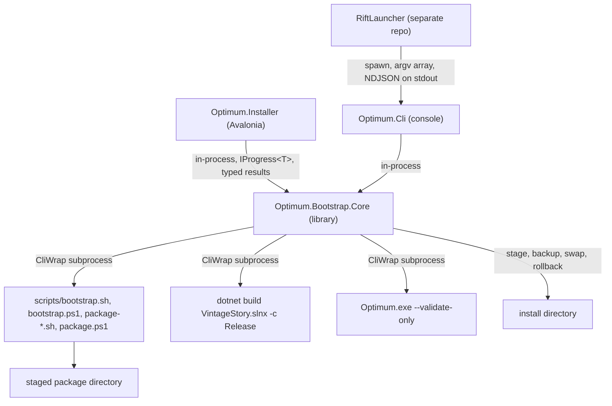

# Avalonia installer: implementation plan

Optimum ships three installers that have drifted apart. `scripts/install-linux.sh`
(921 lines) is an interactive terminal wizard with prerequisite auto-install and
path guards. `scripts/install-windows.ps1` (2195 lines) is a WinForms wizard with
a transactional install, a runtime preflight, a registered uninstaller, and an
EULA. `scripts/install-macos.sh` (282 lines) is a plain prompt loop with none of
that. This plan replaces all three with one C# codebase on .NET 10: a reusable
library (`Optimum.Bootstrap.Core`), a machine-readable command line front end
(`Optimum.Cli`), and an Avalonia GUI (`Optimum.Installer`). The licensing
constraint recorded in `README.md:260` and `NOTICE:11-14` means Optimum can never
ship a prebuilt patched game, so every install must decompile and compile on the
user's own machine, and the installer is a build appliance rather than a file
copier. Two consumers drive the design: the Avalonia GUI, which links the library
in-process, and RiftLauncher, which spawns `Optimum.Cli` as a subprocess and reads
a stable NDJSON stream.

## 1. Background and problem statement

### The three installers do not do the same things

Every capability below exists in at least one installer and is missing from at
least one other. The gaps are not stylistic. They are the difference between a
failed install that rolls back and a failed install that leaves the user with an
empty directory where their game used to be.

| Capability | Linux | Windows | macOS |
| --- | --- | --- | --- |
| Graphical UI | terminal TUI | WinForms wizard | none |
| Prerequisite detection | yes | yes | none |
| Prerequisite auto-install | dotnet, ilspycmd, distro packages | ilspycmd only | none |
| NixOS / non-FHS routing | yes | not applicable | no |
| Version selection | yes, when a bridge patch set exists | `-Version` parameter | none |
| Install-directory guard | `guard_install_dir` | `Assert-SafeInstallerPaths` | none |
| Session-aware data-path detection | yes | no | no |
| Transactional install with rollback | no | yes | no |
| Runtime preflight before commit | no | yes | no |
| Registered uninstaller | no | yes, `Optimum_is1` | no |
| Upgrade detection and version compare | no | yes | partial and broken |
| EULA | no | yes | no |
| Persistent install log | no | yes | no |
| Shortcuts and menu entries | yes | yes | none |
| Install model | standalone package | standalone package | overlay onto a copy |

`scripts/install-linux.sh:732` calls `rm -rf "$INSTALL_DIR"` and then copies the
staged package in. If the copy fails halfway (disk full, a permission change, a
process holding a file open), the user's previous install is gone and the new one
is incomplete. `scripts/install-windows.ps1:718` (`Install-StagedPackage`) does
not have that problem: it copies to `.optimum-stage-<token>`, moves the existing
target to `.optimum-backup-<token>`, moves the stage into place, and only then
deletes the backup, with a rollback in the `catch` block. That function is the
one piece of installer code in the repository worth porting verbatim, and it
exists on exactly one of three platforms.

### The decision already made

RiftLauncher issue #18 settled the toolkit question for new desktop UI in this
ecosystem, and Zaldaryon voted for Avalonia and C# on .NET 10 on 2026-08-17.
Optimum, Stratum, and Nimbus are all C# on .NET 10 already, so an Avalonia
installer shares the language, the SDK pin in `global.json`, the test framework,
and the reviewer pool with the code it installs. Avalonia also ships its own Skia
renderer, so headless CI exercises the same drawing path the user gets.

Electron and Tauri both lose on that second point: Electron would add a Node and
Chromium toolchain to a repository whose only build input today is the .NET SDK,
and Tauri would put the UI in a system webview whose behavior varies per machine,
which is exactly the class of divergence this plan exists to remove.

## 2. Constraints and non-goals

### The licensing constraint

`README.md:260` states that no game binaries or symbols are stored in this
repository or produced by GitHub CI. `NOTICE:11-14` records that the Anego
upstream license files identify the software as proprietary and that the notice
"does not grant permission to redistribute Anego-owned material."
`LICENSE-SCOPE.md:34-45` keeps `patches/**`, `sources/**`, and `Vintagestory/**`
outside the MIT grant.

The consequence is absolute and shapes everything below. Optimum cannot publish a
patched `VintagestoryLib.dll`, cannot publish a donor DLL, and cannot publish a
game archive. The user supplies the official client, and the machine in front of
the user does the decompile and the compile. No GUI removes the roughly 570 MB
client download, the .NET SDK requirement, the ILSpy decompile of
`VintagestoryLib.dll` and `Vintagestory.dll`, or the multi-minute Release build of
`VintageStory.slnx`. A GUI can only make that process legible, interruptible, and
safe to retry.

### Non-goals for this effort

- No reimplementation of `scripts/bootstrap.sh` or `scripts/bootstrap.ps1` in C#.
  Those two files are 1568 and 1756 lines of accumulated decompiler workarounds,
  perl fixups, and patch-application fallbacks. They stay as the execution layer.
  `Optimum.Bootstrap.Core` drives them as subprocesses.
- No change to the Cecil runtime model. `Optimum.Launcher/Program.cs` and
  `Optimum.Patcher` are out of scope except where the installer calls
  `Optimum.exe --validate-only`.
- No redistribution of donors, ever, including inside an installer package.
- The RiftLauncher feature slice lives in the RiftLauncher repository and is a
  separate effort. This plan owes RiftLauncher a stable contract, nothing more.
  Section 5 is that contract.
- No attempt to make the installer work offline on a machine with no .NET SDK and
  no network. That combination cannot produce a build.

### Decisions taken 2026-08-27

Four open questions from an earlier draft are now settled and the sections below
reflect them.

- **The EULA text is rewritten to match `LICENSE-SCOPE.md`.** The current text in
  `scripts/install-windows.ps1:1964` is wrong and does not move into Core as is.
  Phase 1 produces the corrected resource, and it gets a legal review pass before
  it ships.
- **Consent posture is C: a hard click-through gate everywhere.** Local
  decompilation of the user's own Vintage Story copy needs explicit consent, so
  the notice is not enough. The GUI shows a mandatory modal with an acceptance
  checkbox that gates Continue. `Optimum.Cli build` requires
  `--acknowledge-decompile` and refuses with `bad-input` if it is absent, which
  means CI, scripts, and `--non-interactive` runs must all pass it. RiftLauncher
  renders the text in its own UI, collects the acknowledgment, and passes the flag
  when it spawns the engine. The consent covers the license terms and the fact
  that Optimum decompiles a proprietary game on the user's machine to build the
  patch.
- **macOS distribution is deferred.** The project is not obtaining an Apple
  Developer Program account yet, so no signed macOS installer ships. `Optimum.Cli`
  and `Optimum.Installer` still build and run on macOS from source for anyone who
  wants them, and `scripts/install-macos.sh` and `scripts/package-macos.sh` stay
  as the macOS path until an account exists and a signed build ships. Revisit when
  macOS demand justifies the 99 USD per year and the D-U-N-S lead time.
- **macOS packaging, when it does ship, is a Velopack `.pkg`.** Not Avalonia
  Parcel. A recurring Avalonia subscription is not justified for the current macOS
  audience, and Velopack does macOS signing and notarization at no license cost.
- **Velopack is confirmed on .NET 10.** A local spike on 2026-08-27 packed a
  net10.0 self-contained console app with Velopack 1.2.0 for `linux-x64` (AppImage
  plus a 44 KB delta from 1.0.0 to 1.0.1 against a 37 MB full package) and
  `win-x64` (`Setup.exe` plus portable zip). Phase 0's `ci-installer.yml`
  `velopack-smoke` job packs two versions of `Optimum.Cli` and asserts the delta
  package builds. Applying an update at runtime needs a running app and is
  verified in Phase 5.

## 3. Architecture

Three new projects join `VintageStory.slnx`, all MIT, all .NET 10.



Dependency direction is one way. `Optimum.Bootstrap.Core` references nothing in
this repository. `Optimum.Cli` and `Optimum.Installer` both reference Core and
never each other. The GUI does not shell out to the CLI, because doing so would
force every typed result through a serialization round trip and would make GUI
error reporting depend on parsing its own output. RiftLauncher does spawn the CLI,
because a process boundary is the only isolation an Electron main process can get
against a build that takes twenty minutes and allocates gigabytes.

### What lives where

`Optimum.Bootstrap.Core` owns all logic and no presentation:

- The prerequisite model. One record per tool with an id, a detection strategy, an
  acquisition method, and a flag for whether the installer may install it without
  the user leaving the app.
- Detection ported from `scripts/check-prereqs.sh`, from the Linux installer's
  NixOS and non-FHS routing (`scripts/install-linux.sh:119` `detect_nixos`,
  `scripts/install-linux.sh:123` `nixos_dotnet_install_cmd`), and from the Windows
  installer's `Resolve-DotNetPath` (`scripts/install-windows.ps1:336`),
  `Find-AllVintageStory` (`:204`), and `Find-ILSpyCmd` (`:523`).
- The ilspycmd pin and accepted range, read from `.config/dotnet-tools.json`
  (`10.1.1.8388`) and `.config/ilspycmd-compat.json` (`10.1.0.8386` through
  `10.1.1.8388`). The Windows installer already reads both files in
  `Get-Pinned-ILSpyVersion` (`:565`) and `Get-Accepted-ILSpyVersionRange` (`:580`).
  Core reads them once and both front ends share the result.
- Acquisition: the `dotnet-install` script runner, `dotnet tool install -g
  ilspycmd --version <pin>`, and the distro package hints from
  `scripts/install-linux.sh:260-267`.
- A build driver that runs `make`, `scripts/bootstrap.*`, and `scripts/package-*`
  through CliWrap with streamed stdout and stderr and a cancellation token.
- The staged-package transactional installer, ported from `Install-StagedPackage`
  and made to work on all three operating systems.
- Path guards that consolidate `guard_install_dir`
  (`scripts/install-linux.sh:661`) and `Assert-SafeInstallerPaths`
  (`scripts/install-windows.ps1:152`). The guard rejects a symlinked install or
  data directory (the transactional install would otherwise operate on the link's
  target), but not a symlinked parent: an install directory legitimately sits
  under a symlinked home or a mounted second drive. RiftLauncher's full
  `assertNoSymlinkComponents` walk stays available in `SymlinkComponentCheck` for
  a path that is expected to stay within a trusted base. Resolving symlinks in the
  well-known Vintage Story directories before the overlap check is Phase 4 work,
  when the transactional installer lands and it starts to matter.
- Session-aware data-path detection, generalized from
  `scripts/install-linux.sh:580-633`.
- Shortcut writers: Windows `.lnk` and Start Menu, Linux `.desktop` plus a hicolor
  icon, macOS `.app` registration.
- Uninstaller generation and registration, plus an install manifest.
- One EULA text resource.
- The `IProgress<BootstrapProgress>` model and the NDJSON emitter.

`Optimum.Cli` owns argument parsing, NDJSON serialization, POSIX signal handling,
and exit codes. It contains no detection logic, no path logic, and no install
logic. If a behavior can be tested without a process boundary, it belongs in Core.

`Optimum.Installer` owns views, view models, and the screen state machine. It
contains no path validation and no subprocess handling of its own.

## 4. The engine contract

This section is normative. RiftLauncher, or any other caller, may rely on
everything in it. Changing it requires a major version bump of `Optimum.Cli` and a
note in `capabilities`.

### Invocation

```
optimum <verb> [--json] --input <abs> --output <abs> [flags]
```

Callers spawn the binary with `shell: false` and an explicit argv array, a fixed
working directory, and a sanitized environment. The caller should `lstat` the
binary before spawning and refuse to run it if it is a symlink. All path arguments
must be absolute. The engine rejects a relative path with `bad-input` rather than
resolving it against an ambient working directory.

`build`, `preflight`, and `capabilities` need an Optimum checkout, because the
engine drives `scripts/` there. They find it by walking up from the working
directory for `forks.json` next to `scripts/bootstrap.sh`, or take `--repo-root
<abs>`. A caller that spawns the engine from outside a checkout must pass
`--repo-root`. This dependency goes away only when the scripts are ported into
Core, which is out of scope for the current plan (section 2).

### Verbs

| Verb | Arguments | Effect |
| --- | --- | --- |
| `preflight` | `[--repo-root <abs>]` `[--json]` | Detect prerequisites. No side effects, no writes, no network. |
| `build` | `--acknowledge-decompile` `--output <abs>` `[--client-archive <abs>]` `[--version <v>]` `[--repo-root <abs>]` `[--json]` | Bootstrap, check patches, build, package into `--output`, and validate the runtime. `--output` must be empty or absent. Refuses with `bad-input` if `--acknowledge-decompile` is absent. |
| `install` | `--package <abs>` `--install-dir <abs>` `[--data-path <abs>]` `[--shortcuts menu,desktop]` `[--json]` | Transactional deploy: stage the new tree beside the target, move an existing Optimum install aside, swap with one rename, delete the backup, roll back on any failure. Writes an install manifest, the requested shortcuts, and on Windows the uninstall registry entry. A non-empty directory that is not an Optimum install is refused. |
| `validate` | `--package <abs>` `[--json]` | Run the runtime validation described in section 7. |
| `uninstall` | `--install-dir <abs>` `[--json]` | Remove an install by its manifest. Manifest entries that resolve outside the install directory are refused, not followed. |
| `capabilities` | `[--repo-root <abs>]` `[--json]` | Report supported game versions and patch set ids. |
| `--version` | none | Print one plain line and exit 0. |

`build` is the verb RiftLauncher calls. Everything else exists for the GUI, for
scripting, and for CI.

### NDJSON schema

The operation verbs (`build`, `install`, `validate`, `uninstall`) carry a stream:
with `--json`, stdout is one JSON object per line and nothing else, ending in
exactly one terminal `result`. Without `--json` it is human-readable text. The
query verbs (`preflight`, `capabilities`) answer with a single JSON document
(`preflight` an array, `capabilities` an object) and do not use the stream shape.
stderr is always free-form human log, including a subprocess's own output, and
callers must not parse it.

Progress:

```json
{"type":"progress","phase":"decompile","progress":42,"detail":"VintagestoryLib.dll"}
```

`phase` is one of `decompile`, `patch`, `verify`, `assemble`. `progress` is an
integer. `detail` is a human string and carries no contract.

Log:

```json
{"type":"log","level":"info","message":"ilspycmd 10.1.1.8388 accepted"}
```

`level` is one of `info`, `warn`, `error`.

Terminal result, exactly one per run, always the last line:

```json
{"type":"result","ok":true,"runtimePath":"/abs/path/to/Optimum-v0.3.14-linux-x64"}
```

```json
{"type":"result","ok":false,"reason":"patch-conflict","message":"patches/vsapi/0007-...patch did not apply"}
```

### Progress rules

`progress` is a monotonic non-decreasing integer in the range 0 to 99. The engine
never emits 100. The caller owns 100 and emits it after its own post-validation
of the output. This mirrors what RiftLauncher's `runTrackedWorker` in
`src/ipc/handlers/pathsHandlers.ts` already expects, and it exists because a task
that reports 100 before the caller has verified the artifact produces a UI that
says "done" while the caller is still deciding whether to reject the result.

The engine emits at least one progress line per phase and should emit at intervals
short enough that a stalled build is distinguishable from a slow one. A build that
emits nothing for ten minutes during `dotnet build` is indistinguishable from a
hang, and the caller will arm a timeout and kill it.

`NdjsonWriter` enforces the range and the monotonicity: a value below the last
one or above 99 is adjusted to fit, and the writer emits a `warn` log and
increments an anomaly count when it does. A clean run triggers neither, so the
Phase 2 conformance test asserts the anomaly count stayed zero against a real
build stream.

### The reason enum

Closed, kebab-case, stable. The caller maps each value to a localized string
through an exhaustive switch, so adding a value is a breaking change for the
caller and must be announced through `capabilities`.

| Reason | Meaning |
| --- | --- |
| `bad-input` | An argument is missing, relative, malformed, or points at something that is not what it claims to be. |
| `unsupported-version` | The requested game version is not in the set `capabilities` reports. |
| `patch-conflict` | A file under `patches/` failed to apply against the decompiled or cloned source. |
| `decompile-failed` | ilspycmd failed, produced no output, or produced output the fixup passes rejected. |
| `assemble-failed` | `dotnet build` or a packaging script failed. |
| `verification-failed` | The package built but failed the runtime validation in section 7. |
| `output-exists` | `--output` already contains an artifact and the engine will not overwrite it. |
| `cancelled` | The engine received SIGTERM and stopped. Partial output was rolled back. |
| `engine-internal` | An unexpected fault in the engine. Always accompanied by a `message`. |

### Exit codes and signals

Exit 0 when the terminal result has `"ok":true`, non-zero otherwise. The result
line is authoritative. A caller that sees `"ok":true` and a non-zero exit code
should treat the run as successful and log the discrepancy, because a non-zero
exit from a wrapper, a shell, or a signal after the work completed is a more
likely explanation than a lying result line. A caller that sees a non-zero exit
and no result line at all must synthesize `engine-internal`.

On SIGTERM or SIGINT the engine stops the current phase and cleans up. Because
`--output` was required to be empty or absent, cleanup removes the directory when
the engine created it and removes only the new contents when it pre-existed;
either way nothing the engine did not write is touched. It then emits
`{"type":"result","ok":false,"reason":"cancelled"}` and exits non-zero. If the
process cannot emit the line (SIGKILL, or a crash inside the handler), the caller
falls back to `engine-internal`. `PosixSignalRegistration` handles both signals on
Windows as well.

### Path discipline

Every path the engine accepts and every path it emits is absolute. The engine
writes only inside `--output` and inside its own temporary directory. It never
writes inside `--input`, never writes to the user's game directory during `build`,
and never follows a symlink out of `--output`. The caller re-validates the output
before registering it, because the engine's guarantee is a promise and the
caller's check is a fact.

### Consent

`build` decompiles a proprietary game on the user's machine, which needs the
user's explicit consent (see the decisions block in section 2). The engine does
not carry the consent text or a UI for it. The caller owns both: it shows the
license and decompilation notice, collects an affirmative acknowledgment, and only
then spawns `build` with `--acknowledge-decompile`. The engine treats a missing
flag as `bad-input` and does no work. `preflight`, `install`, `validate`,
`uninstall`, and `capabilities` do not decompile anything and do not take the
flag.

### Division of labour with RiftLauncher

RiftLauncher downloads every input through its verified downloader, which already
allowlists `cdn.vintagestory.at`, and hands Optimum local absolute paths. Optimum
performs an offline transform confined to `--output`. RiftLauncher re-validates
the output and registers it.

`--client-archive` is the handoff point. `scripts/bootstrap.sh:30` and `:43`
already accept `--client-archive PATH`, and `scripts/bootstrap.ps1:44` accepts
`-ClientArchive`, so the plumbing exists. `Optimum.Cli build --client-archive`
forwards the path and the engine performs no network access for the client
download. The engine still needs network for the fork clones listed in
`forks.json` and for NuGet restore, and this plan does not propose to change that.
An engine run with `--client-archive` is not fully offline, and the contract must
not claim otherwise.

### Discovery

`optimum --version` prints one plain line, for example `0.3.14`, and exits 0.
`optimum capabilities --json` prints a single JSON object naming the supported
game versions and the patch set ids, so a caller can decide whether to invoke
`build` at all rather than discovering `unsupported-version` after a 570 MB
download.

### Worked example

A `build` run against a cached client archive, abbreviated:

```
{"type":"log","level":"info","message":"optimum 0.3.14"}
{"type":"log","level":"info","message":"client archive accepted: /var/cache/rl/vs_client_linux-x64_1.22.7.tar.gz"}
{"type":"progress","phase":"decompile","progress":2,"detail":"extracting client archive"}
{"type":"progress","phase":"decompile","progress":18,"detail":"ilspycmd VintagestoryLib.dll"}
{"type":"progress","phase":"decompile","progress":31,"detail":"ilspycmd Vintagestory.dll"}
{"type":"progress","phase":"patch","progress":40,"detail":"cloning vsapi at 63d33f7"}
{"type":"progress","phase":"patch","progress":55,"detail":"applying patches/vsapi"}
{"type":"progress","phase":"assemble","progress":62,"detail":"dotnet build VintageStory.slnx -c Release"}
{"type":"log","level":"warn","message":"innoextract not present; Windows package skipped"}
{"type":"progress","phase":"assemble","progress":88,"detail":"package-linux.sh"}
{"type":"progress","phase":"verify","progress":96,"detail":"runtime validation"}
{"type":"result","ok":true,"runtimePath":"/var/lib/rl/out/Optimum-v0.3.14-linux-x64"}
```

The caller emits its own 100 after it has checked the directory.

## 5. The GUI

`Optimum.Installer` uses the `avalonia.mvvm` template with CommunityToolkit.Mvvm
and CompiledBindings enabled from the first commit. The screen flow copies the
Windows WinForms wizard, because that flow has already survived contact with users
and its ordering constraints are real: prerequisites gate the Install button, the
EULA gates the build, and the log pane exists because builds fail and the user
needs the reason.

### Screens

**Prerequisites.** One row per tool: name, status (`OK`, `MISSING`, `OLD`,
`optional`), and an action button whose label depends on what the installer can
actually do. `Install` when the tool can be acquired without leaving the app,
`Download` when it cannot, `Browse` when the tool exists but the installer cannot
find it. `Continue` stays disabled while any required tool is missing, matching
`Get-MissingRequiredTools` at `scripts/install-windows.ps1:509`. On Linux the row
for the .NET SDK changes its label and its action on NixOS and other non-FHS
systems, as `scripts/install-linux.sh:336-346` already does. The Vintage Story
row shows the detected install path and its version, read from the executable
rather than from a registry key, because the in-game updater rewrites the
executable and leaves the registry stale (`Get-VsExeVersion`,
`scripts/install-windows.ps1:191`).

**Install options.** Install folder with a Browse button and live validation.
Optional separate data folder, defaulting to the detected session folder from
section 7. Menu entry and desktop shortcut toggles. A version selector, shown only
when a `patches-<version>-bridge/` directory offers an alternate, matching
`scripts/install-linux.sh:532-552`. Validation runs on every change and reports
inline, not on Continue, so the user does not fill in three fields and then learn
the first one was wrong.

**EULA modal.** Mandatory, scrollable, with an acceptance checkbox that gates the
Continue button. Shown on every attempt to start an install, as the Windows
installer does at `scripts/install-windows.ps1:1953`.

**Progress and log.** A phase label driven by the `BootstrapProgress` phase, a
determinate progress bar, an honest elapsed and estimated remaining time, and a
filtered log pane. The filter reproduces the Windows behavior at
`scripts/install-windows.ps1:1281-1301`: phase markers drive the status label, a
whitelist of progress prefixes shows verbatim, and any line matching `error`,
`FAILED`, `ERROR`, or `throw` always shows regardless of the whitelist. A Cancel
button issues the two-tier CliWrap cancellation (graceful token, then forceful).

**Completion.** On success, a Launch button and the install path. On failure, the
reason, the message, and a View Log button that opens the saved log.

### State machine

```
Prerequisites --Continue--> Options --Continue--> EULA
EULA --Accept--> Progress
EULA --Decline--> Options
Progress --success--> Completion(ok)
Progress --failure--> Completion(error)
Progress --Cancel--> Completion(cancelled)
Completion(error) --Retry--> Prerequisites
Completion(cancelled) --Retry--> Prerequisites
```

Backwards navigation is allowed from Options to Prerequisites and blocked once
Progress starts, because the build is already writing to disk.

### Feature migration table

| Current behavior | File | Lands in |
| --- | --- | --- |
| `--install-dir`, `--data-path`, `--version`, `--no-menu-entry`, `--desktop-shortcut` | `scripts/install-linux.sh:73-80` | `Optimum.Cli install` flags and the Options screen |
| `--package-dir` (install from a prebuilt folder) | `scripts/install-linux.sh:75` | `Optimum.Cli install --package` |
| `--skip-build` | `scripts/install-linux.sh:76` | `install` verb used without a preceding `build` |
| `--non-interactive` | `scripts/install-linux.sh:80` | the CLI itself; the GUI has no silent mode |
| Prereq checklist and per-tool auto-install | `scripts/install-linux.sh:260-346` | Core prerequisite model, Prerequisites screen |
| NixOS / non-FHS routing | `scripts/install-linux.sh:95-124` | Core detection, surfaced as a different action on the SDK row |
| Bridge version prompt | `scripts/install-linux.sh:532-552` | Options screen version selector |
| `guard_install_dir` | `scripts/install-linux.sh:661` | Core path guards |
| Session-aware data-path detection | `scripts/install-linux.sh:580-633` | Core, on all three operating systems |
| `optimum-launch.sh` and `datapath.cfg` | `scripts/install-linux.sh:742-764` | Core shortcut and launcher writers |
| `.desktop` entry and hicolor icon | `scripts/install-linux.sh:766-790, 876-886` | Core shortcut writers |
| WinForms wizard sections and dark/light detection | `scripts/install-windows.ps1` GUI block | Avalonia views with theme-aware resources |
| EULA modal | `scripts/install-windows.ps1:1953-2027` | Core EULA resource, Installer modal with a real checkbox gate, posture C per section 2 |
| Vintage Story auto-detection | `scripts/install-windows.ps1:204-294` | Core detection |
| `Resolve-DotNetPath` probes | `scripts/install-windows.ps1:336` | Core detection |
| `Assert-SafeInstallerPaths`, `Assert-DirectoryWritable` | `scripts/install-windows.ps1:152, 123` | Core path guards |
| Upgrade and reinstall prompts | `scripts/install-windows.ps1:327` | Core install manifest read, Options screen |
| Short build path to dodge MAX_PATH | `scripts/install-windows.ps1:926-945` | Core build driver, Windows only |
| `robocopy` workspace copy and vanilla junction | `scripts/install-windows.ps1:1011-1029` | Core build driver, Windows only |
| `Invoke-RuntimePreflight` | `scripts/install-windows.ps1:669` | `Optimum.Cli validate`, all platforms, see section 7 |
| `Install-StagedPackage` | `scripts/install-windows.ps1:718` | Core transactional installer, all platforms |
| Uninstaller registry registration | `scripts/install-windows.ps1:1142` | Core uninstaller registration, all platforms |
| Detached log tail and saved raw log | `scripts/install-windows.ps1:1265-1301, 1912` | Core streamed output, Installer log pane, saved log on all platforms |
| macOS VS candidate paths and picker | `scripts/install-macos.sh:66-132` | Core detection |
| macOS version-mismatch guard | `scripts/install-macos.sh:179-199` | Core, generalized as a pre-build check on all platforms |

## 6. Cross-OS unification

| Gap | Resolution |
| --- | --- |
| macOS has no GUI, no prerequisites, no shortcuts, no version selection, no data-path prompt | `Optimum.Installer` runs on macOS with the same screens and the same Core |
| Windows lacks session-aware data-path detection | Core implements it once; the Windows candidate list adds `%APPDATA%\VintagestoryData` and `%APPDATA%\OptimumData` |
| Linux and macOS have no transactional install | Core's ported `Install-StagedPackage` runs everywhere |
| Linux and macOS have no runtime preflight | See section 7; this one is not free |
| Linux and macOS have no registered uninstaller | Core writes an install manifest at the install root and registers it: Windows registry under `HKCU:\...\Uninstall\Optimum_is1`, Linux a `.desktop` action plus the manifest, macOS the manifest inside the bundle |
| Linux and macOS have no upgrade detection | Core reads the manifest, compares versions, and the Options screen offers upgrade, reinstall, or cancel |
| Only Windows shows an EULA | One EULA resource in Core, shown by the Installer on every platform |
| Only Windows persists an install log | Core writes the raw log to a per-platform application data directory on every platform |
| macOS uses an overlay model, the others use standalone packages | macOS moves to the standalone-package model |

### The macOS overlay retirement

`scripts/install-macos.sh` currently copies the user's whole vanilla install to a
sibling `Optimum/` directory (`:277`, `:205`) and overlays Cecil-patched engine
DLLs onto the copy. The file's own header at `:4-5` claims it "Installs Optimum
INTO the Vintage Story directory" and does not modify vanilla files, which no
longer describes what the script does. Worse, `--uninstall` at `:262-266` operates
on `$VS_DIR`, not on `$INSTALL_DIR`, so it cannot remove a sibling install at all,
and the upgrade branch at `:269-275` deletes files from `$VS_DIR` while the
install writes to `$INSTALL_DIR`. The script also requires build outputs from a
`make dist` target that does not exist in the `Makefile`.

`scripts/package-macos.sh:138` already assembles `Optimum.app` and `:275-323`
already produces a `.dmg` or a `.tar.gz` fallback. The new installer consumes that
`.app` and installs it transactionally, which makes macOS structurally identical to
Linux and Windows. What migrates from the old script: the five VS candidate paths
at `:68-74`, the numbered picker at `:117-131`, and the version-mismatch guard at
`:179-199`, which caught a real shader `KeyNotFoundException` during 1.22.6
verification and is worth generalizing to every platform. What is retired: the
overlay copy, the eleven-name `OPTIMUM_FILES` list, and the `--uninstall` branch.

This retirement lands when macOS gets a signed release, which is deferred (see the
decisions block in section 2). Until then `scripts/install-macos.sh` stays and the
new installer runs on macOS only from a source build.

Users of the old overlay model need a migration path. Section 12 records this as a
risk, and the concrete answer is that `Optimum.Cli uninstall` detects a legacy
overlay by the presence of `Optimum.dll` and `.optimum/version` next to a
`VintagestoryLib.dll` and removes it using the old file list before the new
install proceeds.

## 7. Prerequisite handling

### The tool list

`scripts/check-prereqs.sh:15-30` is the authoritative list and Core ports it
directly. Required: `dotnet`, `git`, `perl`, `python3`, `curl`, `tar`, `pwsh`,
`chmod`. Optional: `unzip`, `ilspycmd`, `make`, `cmake`, `mkisofs`, `innoextract`
at 1.11 or newer.

Two notes on that list, because it is easy to get wrong. `pwsh` is marked required
at `scripts/check-prereqs.sh:23`, not optional, because `package-linux.ps1`,
`package-macos.ps1`, and `package.ps1` need it. That is stricter than a Linux user
building only a Linux package actually needs, and Core should model `pwsh` as
required-for-packaging rather than required-for-everything so a Linux user is not
told to install PowerShell to produce a `tar.gz`. And `appimagetool` is not in
`check-prereqs.sh` at all; `scripts/package-linux.sh:58-91` detects it separately,
falls back to `.tools/appimagetool`, and offers its own install. Core should fold
that detection into the same model rather than leaving it in one packaging script.

### Detection per platform

Linux and macOS use `command -v` equivalents plus the version probes already in
the shell scripts. Windows cannot rely on `PATH` alone: `Resolve-DotNetPath`
(`scripts/install-windows.ps1:336`) probes Visual Studio's bundled `dotnet\`
directory, Scoop, and Chocolatey, and `Find-AllVintageStory` (`:204`) walks Inno
Setup uninstall registry keys and roughly forty filesystem locations across
`%APPDATA%`, `%LOCALAPPDATA%`, Program Files, and every drive root, in both the
`Vintagestory` and `Vintage Story` spellings. All of that ports to Core as data,
not as code: a list of probe locations per platform, evaluated by one shared
walker.

ilspycmd detection reads the pin from `.config/dotnet-tools.json` and the accepted
range from `.config/ilspycmd-compat.json` and rejects a version outside the range,
because `scripts/bootstrap.sh:446` calls `ilspycmd "$dll_path" --project` and a
decompiler outside the tested range produces source the fixup passes in
`scripts/fix-base-ctor-calls.py` and `scripts/fix-closure-class.pl` were not
written against.

### What auto-installs

- ilspycmd, through `dotnet tool install -g ilspycmd --version <pin>`, matching
  `scripts/bootstrap.sh:146`. This is the only tool the Windows installer installs
  today.
- The .NET SDK, through the official `dotnet-install` scripts from
  `https://dot.net/v1/`, into a private per-application directory with
  `--install-dir` and `--no-path`. The Linux installer does this today at
  `scripts/install-linux.sh:288` with `--channel 10.0`. Core should instead pass
  `--jsonfile global.json` so the acquired SDK matches the `10.0.100` pin with
  `rollForward: latestFeature` rather than whatever the channel currently serves.
  Core then invokes that `dotnet` by absolute path with `DOTNET_ROOT` set on the
  child process only, and never mutates the user's `PATH`.
- On Windows, winget is a fast path for the SDK and for Git when it is present.
- Distro packages are offered as a hint with a copyable command, not run. The
  Linux installer builds those commands at `scripts/install-linux.sh:260-267` for
  apt-get, dnf, pacman, and zypper. An installer that runs `sudo` on the user's
  behalf is a support burden and a security question this plan declines to open.

### NixOS and non-FHS routing

`scripts/install-linux.sh:95-124` detects a missing standard glibc dynamic linker
and refuses to run the `dot.net` installer, because the SDK it downloads hardcodes
an interpreter path that does not exist on NixOS. Core keeps that refusal and
keeps the substitute instruction `nix profile install nixpkgs#dotnet-sdk_10`. The
completion screen keeps the warning at `scripts/install-linux.sh:913-914` that the
resulting binaries need an FHS environment such as `steam-run`.

### The SDK bootstrapping paradox

`Optimum.Installer` is a .NET application whose job includes installing .NET. If
the installer ships framework-dependent, a user with no .NET cannot run the thing
that installs .NET. The resolution is that `Optimum.Installer` and `Optimum.Cli`
ship self-contained per RID, so they carry their own runtime and depend on nothing
preinstalled. The SDK they then acquire is for the build, not for themselves. The
cost is roughly 55 to 60 MB on disk per RID for an untrimmed self-contained
Avalonia application, about 25 MB compressed, which is negligible next to the
570 MB client download the user is about to make anyway.

### Runtime validation on Linux and macOS

This gap needs its own paragraph, because the plan cannot close it by porting
code. `Invoke-RuntimePreflight` (`scripts/install-windows.ps1:669`) runs
`Optimum.exe --validate-only` from the staged package and requires a
`.optimum/package-complete` marker at `:680`. Neither the marker nor the managed
launcher exists in a Linux or macOS package. `scripts/package.ps1:298` and `:401`
write `.optimum/standalone-install` and `.optimum/package-complete`;
`scripts/package-linux.sh` and `scripts/package-macos.sh` write neither. More
fundamentally, `scripts/package-linux.sh:341` produces the `Optimum` binary by
copying the vanilla apphost, and neither Linux nor macOS packaging stages
`Optimum.dll`, `Optimum.Patcher.dll`, or the `Mono.Cecil` assemblies. Those
packages ship pre-patched DLLs and never run the Cecil transplant at launch, which
means the `.optimum/donors/` directory that `scripts/package-linux.sh:267-274`
carefully populates has no consumer on those platforms.

Two options were on the table:

1. Ship `Optimum.Launcher` in the Linux and macOS packages, add the two markers,
   and get true parity plus a real `--validate-only`. This is the larger change and
   it alters what those packages contain.
2. Implement `validate` in Core over the staged DLLs, without the launcher.

Phase 4 took option 2. `RuntimeValidator` checks the package layout, that the
three engine assemblies parse, and then loads `VintagestoryLib.dll` into a
`MetadataLoadContext` (metadata only, no execution, no native dependencies) and
confirms `Vintagestory.Client.ClientProgram` still has a static `Main`. That
catches a patch that removed the entry point without the risk of loading game
code into the installer process. The full JIT probe from `Optimum.exe
--validate-only` stays available for a later proposal that changes what the
Linux and macOS packages contain.

## 8. Packaging and distribution of the installer

Velopack 1.2 or newer handles Windows and Linux with one toolchain and one
release feed, and it supports delta updates. On Windows it integrates signtool and
Azure Trusted Signing and produces a `Setup.exe` plus a portable zip. On Linux its
only output format is AppImage. The spike on 2026-08-27 confirmed both for a
net10.0 self-contained app.

If `.deb` or `.rpm` packages are required, PupNet Deploy produces them, and that
path has no auto-update. This plan does not propose `.deb` or `.rpm` for the first
release: AppImage matches what `scripts/package-linux.sh --format appimage`
already produces for the game package, so the installer and the thing it installs
use the same Linux distribution format.

macOS is not part of the first distributed release. Signing and notarizing a
macOS bundle requires a paid Apple Developer Program membership, and the project
has decided not to obtain one yet. An unsigned installer is not an acceptable
artifact: `README.md:254` records that an unsigned bundle makes Gatekeeper warn,
and an installer is exactly the kind of binary a user should refuse to run when
the operating system warns about it. So `Optimum.Installer` and `Optimum.Cli`
build for `osx-arm64` and `osx-x64` and run for anyone who builds them, but the
release workflow publishes nothing for macOS. `scripts/install-macos.sh` and
`scripts/package-macos.sh` stay as the macOS path in the meantime.

When macOS does ship, the format is a Velopack `.pkg`. Velopack handles
`codesign` and notarization at no license cost. Avalonia Parcel, which would
produce a `.dmg` and automate the `Info.plist` and bundle assembly, is rejected:
its full signing feature sits behind a recurring Avalonia subscription that the
current macOS audience does not justify. The cost of the `.pkg` choice is that
macOS users get a guided installer where some expect a drag-to-Applications
window, which is a reasonable trade for a tool that then runs a long build.

Ship untrimmed. Avalonia's XAML loader uses reflection heavily and trimming
removes types the loader resolves by name, which fails at runtime rather than at
build time. An installer that crashes on its second screen because the linker
removed a converter is worse than an installer that is 30 MB larger.

## 9. Testing strategy

### Optimum.Bootstrap.Core.Tests

Plain xUnit, no UI. The existing shell tests are the behavior specification to
port: `scripts/tests/install-linux-prerequisites.sh` and
`scripts/tests/install-linux-nixos.sh`. The second one is not currently wired into
any C# test, so porting it is a net gain in coverage, not a like-for-like move.

Coverage targets, in rough priority order: the path guards, with cases for `/`,
`$HOME`, `$XDG_DATA_HOME`, `$HOME/.local`, a drive root, a path inside the Vintage
Story directory, a directory holding a vanilla `Vintagestory` binary with no
Optimum marker, and a symlinked install directory. The transactional installer,
with an injected failure at each of the four steps and an assertion that the
previous install came back. Prerequisite detection against fixture filesystems for
each platform. The ilspycmd version-range comparison. Session-aware data-path
detection, including the case where two candidate directories exist and only the
second has a `playeruid` in its `clientsettings.json`.

### Optimum.Cli.Tests

Contract conformance. The central test is a fixture that consumes the NDJSON
stream the same way RiftLauncher's `runTrackedWorker` does and asserts:

- Every stdout line under `--json` parses as JSON and has a known `type`.
- `progress` values are integers, non-decreasing across the whole run, and never
  exceed 99.
- Exactly one `result` line exists and it is the last line.
- A `result` with `"ok":false` carries a `reason` from the closed enum and a
  non-empty `message`.
- The exit code agrees with `ok`.
- Nothing that is not NDJSON reaches stdout, including from a subprocess. This is
  the one that will actually catch a regression, because the moment Core forgets to
  redirect a script's stdout, a line of shell output lands in the middle of the
  stream and the caller's parser throws.
- SIGTERM mid-run produces `{"ok":false,"reason":"cancelled"}` and leaves
  `--output` empty.

Each failure `reason` gets a test that induces it. `patch-conflict` is inducible
with a deliberately corrupted patch fixture. `unsupported-version` is inducible by
asking for a version `capabilities` does not list. `output-exists` is inducible by
pre-creating the directory.

### Optimum.Installer.Tests

`Avalonia.Headless.XUnit` with `[AvaloniaFact]` and `[AvaloniaTheory]`. This runs
on stock `ubuntu-latest` with plain `dotnet test` and needs no xvfb, as long as no
test enables real Skia rendering for pixel assertions. Coverage: the screen state
machine transitions, the Continue-button gating on prerequisite status, the EULA
gate, inline validation on the Options screen, and the log filter, which should get
a test asserting that a line containing `error` shows even when it is not on the
whitelist.

View models are also testable with plain xUnit where they have no visual tree
dependency, and that is the preferred form when it is available.

### Existing tests

`Optimum.Tests/installer-release-coverage-tests.cs` (624 lines) and
`Optimum.Tests/installer-path-normalization-tests.cs` (88 lines) are mostly
source-text regression pins against the PowerShell installer, plus real subprocess
runs of the shell tests and of `scripts/runtime-donor-patch-gate.sh` and
`scripts/validate-patch-syntax.sh`. They stay green for as long as the scripts they
pin exist. When Phase 6 turns `scripts/install-*.sh` into shims, the source-text
pins in that file are deleted alongside the code they pin, and the subprocess runs
of the gate scripts move to `Optimum.Bootstrap.Core.Tests`.
`Optimum.Launcher.Tests/DataPathArgumentTests.cs` pins the `--dataPath` and
`datapath.cfg` contract and is untouched by this plan.

### Definition of done

1. A real end-to-end install on Linux and Windows from a clean machine that
   finishes and launches the game into a world, verified by a person, not by a
   script. On macOS the same run from a source build of `Optimum.Installer`,
   unsigned, accepted through the Gatekeeper right-click bypass, since macOS has
   no signed release yet.
2. `Optimum.Cli build --json` green on every job of the extended
   `.github/workflows/ci-platform-bootstrap.yml`, with the NDJSON conformance
   assertion running against the real stream.
3. All three new test projects green on the push workflow.
4. Every test that passes today still passing.

## 10. CI changes

Today `.github/workflows/ci-platform-bootstrap.yml` is the only workflow, it is
`workflow_dispatch` only, and it has five jobs: `bootstrap-windows`
(`windows-latest`), `bootstrap-macos-intel` (`macos-15-intel`),
`bootstrap-macos-arm` (`macos-14`), `bootstrap-linux` (`ubuntu-24.04`), and
`bootstrap-linux-arm` (`ubuntu-24.04-arm`). Each sets up .NET `10.0.x`, resolves
and caches the client archive, bootstraps with `--client-archive`, builds
`VintageStory.slnx -c Release`, runs `check-patches.sh --strict-unavailable`, and
runs the two test projects. The Windows job also runs `scripts/package.ps1`.

Three changes:

**A new push and pull-request workflow.** Runs on `ubuntu-latest` only. Builds
`Optimum.Bootstrap.Core`, `Optimum.Cli`, and `Optimum.Installer`, then runs
`dotnet test` for all three new test projects. This must not require a bootstrap,
which means the three new projects must not reference any project that depends on
decompiled sources. That constraint is worth stating explicitly because it is easy
to violate: the moment `Optimum.Bootstrap.Core.Tests` references
`Optimum.Launcher`, the workflow needs a 570 MB download and stops being a fast
pull-request gate.

**An extension to the platform workflow.** The `bootstrap-linux` job runs
`Optimum.Cli build --json --acknowledge-decompile --client-archive <cached>` end
to end after its existing build and pipes the stream through
`scripts/check-ndjson-stream.py`, then `Optimum.Cli validate` on the produced
package. It keeps the manual bootstrap and build steps as well, so a driver bug
is a distinct signal from a pipeline bug; the job timeout moved to 60 minutes to
cover the second pipeline run. The cached archive is already resolved by the
existing `Resolve client archive` and `Cache client archive` steps, so this adds
compute time and no new download. The other four platform jobs get the same step
once the driver has proven itself on Linux.

**A release workflow.** Runs `vpk pack` for `win-x64` and `linux-x64` and
publishes the Velopack feed. Signing credentials for Windows come from repository
secrets. This workflow is the only one that touches signing. It builds the
`osx-arm64` and `osx-x64` binaries for archival but publishes nothing for macOS
until an Apple Developer Program account and a signing certificate exist. The
`velopack-smoke` job in `ci-installer.yml` already packs two versions and checks
the delta builds; Phase 5 adds the runtime apply check once there is an app to run
it against.

## 11. Rollout plan

Each phase ships independently and leaves the repository in a working state. No
phase depends on a later phase to be useful.

**Phase 0: scaffold.** Done. `Optimum.Bootstrap.Core`, `Optimum.Cli`,
`Optimum.Installer`, and their three test projects exist, sit in a `/Installer/`
folder in `VintageStory.slnx`, and build and test through `Optimum.Installer.slnf`
without a bootstrap. `Optimum.Bootstrap.Core` carries the `ProgressPhase` and
`FailureReason` contract types; `Optimum.Cli` answers `--version`;
`Optimum.Installer` is a one-window Avalonia app with a headless render test.
`.github/workflows/ci-installer.yml` runs the tests and the `velopack-smoke` job
on push and pull request.
*Verification:* `dotnet test Optimum.Installer.slnf -c Release` is green (eleven
tests, one a headless Avalonia render) in about three seconds locally; the
workflow is expected green under five minutes.

**Phase 1: Core fundamentals.** Done. `Optimum.Bootstrap.Core` now carries the
prerequisite model and per-platform detection (`PrerequisiteScanner`,
`DotnetSdkProbe`, the `.config/` readers, `NixEnvironment`), acquisition planning
(`SdkAcquisition` with the NixOS and non-FHS refusals, `IlspycmdAcquisition`), the
path guards (`InstallPathGuard`, `SymlinkComponentCheck`), session-aware data-path
detection (`DataPathProbe`), the NDJSON emitter (`NdjsonWriter`), and the consent
notice resource rewritten to match `LICENSE-SCOPE.md`. Every detection path goes
through the `ISystemProbe` seam so tests use an in-memory host. No build driver
yet.
*Verification:* `Optimum.Bootstrap.Core.Tests` has 75 tests covering every
path-guard case in section 9, the exact ilspycmd accept and reject values from
`scripts/tests/install-linux-prerequisites.sh`, and the NixOS and non-FHS
behaviors from `scripts/tests/install-linux-nixos.sh`. An adversarial pass against
the shell sources drove three refinements: `command -v` detection now checks the
execute bit and keeps searching past a non-executable match, the path guard
rejects a symlinked leaf rather than any symlinked ancestor, and `NdjsonWriter`
emits a `warn` and counts it when it has to adjust a caller's progress value.
`dotnet test Optimum.Installer.slnf -c Release` is green (79 tests, about six
seconds).

**Phase 2: the CLI.** Done. The seven verbs are in `Optimum.Cli` over a Core
build layer. `ScriptBuildDriver` drives, in order, `scripts/bootstrap.*`, `dotnet
build VintageStory.slnx`, `scripts/check-patches.sh --strict-unavailable`, the
platform packaging script, and a header-level `RuntimeValidator` on the produced
package, mapping each step to a `ProgressPhase` and a `FailureReason`
(`BootstrapFailureClassifier` splits a failed bootstrap into `patch-conflict` and
`decompile-failed`). It forwards `--client-archive` to both bootstrap and
packaging so neither half re-downloads the client, locates the package per
platform (an `Optimum-v*` directory on Windows and Linux, `Optimum.app` on
macOS), and on cancellation removes only what it wrote. `build` requires
`--acknowledge-decompile`. `install` runs the Phase 1 path guard then a copy into
an empty directory plus an `InstallManifest` (it refuses a non-empty target;
in-place replace with rollback is Phase 4); `uninstall` reverses it by that
manifest and refuses an entry that resolves outside the install directory;
`validate` reads the staged assemblies' headers; `capabilities` and `preflight`
answer with a single JSON document. SIGTERM and SIGINT cancel a `build` and
produce a `cancelled` result. `scripts/check-ndjson-stream.py` is the reusable
conformance check, the twin of `Optimum.Cli.Tests/NdjsonStream.cs`.
*Verification:* `Optimum.Cli.Tests` has 13 tests including the NDJSON contract
against a scripted driver, the `patch-conflict` and `cancelled` reasons, the
no-flag gate, and a clean run with no progress anomalies. An adversarial pass
against the shell scripts drove the client-archive forwarding, the macOS package
location, the empty-output guard and the scoped cancellation cleanup, the
manifest-entry containment in `uninstall`, and `install` refusing to overwrite.
`ci-installer.yml` gained a `cli-contract` job. The `bootstrap-linux` job in
`ci-platform-bootstrap.yml` now runs `Optimum.Cli build --json
--acknowledge-decompile --client-archive` end to end through
`check-ndjson-stream.py`, then `Optimum.Cli validate`. The other four platform
jobs get the same step incrementally.

**Phase 3: the GUI.** Done. `Optimum.Installer` is an Avalonia 12 MVVM app that
drives Core in-process, never the CLI. `MainWindowViewModel` is the wizard shell
and state machine: Prerequisites, Options, a mandatory EULA modal over Options,
Progress, Completion, with backward navigation only from Options to Prerequisites
and blocked once Progress starts. `PrerequisitesViewModel` renders
`PrerequisiteScanner` rows and gates Continue on `BlocksBuild`.
`OptionsViewModel` defaults the install directory per platform, runs
`InstallPathGuard` on every keystroke into an inline error, picks up a detected
data folder from `DataPathProbe`, and shows a version selector only when
`Capabilities` reports a bridge set. `EulaViewModel` gates accept on a
scroll-to-end plus a checkbox. `ProgressViewModel` is its own `IBuildObserver`,
runs `ScriptBuildDriver` then `PackageDeployer`, and filters raw subprocess lines
through `InstallerLogFilter` (ported from the Windows installer's filter).
`CompletionViewModel` offers Launch, Try again, or View log. A `ViewLocator`
resolves each view model to its view. `FakeSystemProbe` moved to a plain
`Optimum.Bootstrap.Core.TestSupport` project so the v2 and v3 test projects can
both use it.
*Verification:* `Optimum.Installer.Tests` has 35 tests (33 plain xUnit v3 on the
view models plus two `Avalonia.Headless.XUnit` render tests), green on
`ubuntu-latest` with no xvfb, covering the state machine transitions, the
Continue gating, the EULA gate, inline validation, the log filter, the
build-then-deploy flow against fakes, re-entrancy on double-accept, retry from a
cancelled run, and temp-directory cleanup. An adversarial pass drove: the Launch
button running the launcher directly rather than through `xdg-open`, the
temporary build tree being deleted after the deploy, an elapsed clock that ticks
on its own timer, two-tier graceful-then-forceful cancellation through
`IBuildDriver.RunAsync`, a re-entrancy guard on accept, a rebuilt Options screen
on retry, and a scroll-read gate extracted to a pure `ScrollReadGate` so it is
tested directly. A real install per platform is still a manual check.

**Phase 4: unification.** Done. `PackageDeployer` is transactional on every
platform: it stages the whole new tree beside the target (so the final swap is
one rename), moves an existing Optimum install to `.optimum-backup-<token>`,
swaps the stage in, and deletes the backup; any failure rolls back to the
previous install and the `finally` clears the stage and backup directories. A
`FailAtStep` hook drives the rollback tests. `ShortcutWriter` writes the
menu and desktop shortcuts per platform (Linux `.desktop` plus a hicolor icon,
Windows `.lnk` through `WScript.Shell`, macOS a symlink into `~/Applications`),
records their paths in the manifest, and removes them on uninstall.
`UninstallRegistration` writes and removes the Windows `Optimum_is1` uninstall
key, a no-op elsewhere. `RuntimeValidator` took option 2 from section 7:
`MetadataLoadContext` over `VintagestoryLib.dll`, no game code executed.
Session-aware data-path detection was already cross-platform (`DataPathProbe`,
Phase 1) and is used by the GUI.
*Verification:* `Optimum.Bootstrap.Core.Tests` has 103 tests, including an
injected failure at the swap step that restores the previous install and a
user-added file across it, a full deploy-then-uninstall filesystem-clean check,
in-place replacement, and the Linux `.desktop` write-and-remove round trip
through the manifest. Windows `.lnk` and registry paths and the macOS symlink
are covered by construction and need a manual check on those platforms.

**Phase 5: distribution.** Velopack packaging for `win-x64` and `linux-x64`, the
release workflow, signing on Windows. macOS binaries build but do not publish.
*Verification:* a signed Windows installer and a Linux AppImage download and run
on a clean machine without an operating system warning, and a delta update from
the previous version applies.

**Phase 6: documentation and deprecation.** Update `README.md`, add the three new
project paths to the MIT list in `LICENSE-SCOPE.md`, note the new build and test
targets in `CONTRIBUTING.md`, and turn `scripts/install-linux.sh` and
`scripts/install-windows.ps1` into thin shims that forward to `Optimum.Cli`. Leave
`scripts/install-macos.sh` alone: it stays the macOS path until a signed macOS
release exists, so its retirement waits for the Apple account and a later phase.
Fix or replace `scripts/uninstall.sh`, which today cannot uninstall anything:
`scripts/uninstall.sh:75` exits 0 unless `$VS_DIR/Optimum.dll` exists, and the
current Linux standalone package contains no `Optimum.dll`, so the script reports
"Optimum not installed" and returns without even reaching the `.desktop` cleanup
at `:122-123`.
*Verification:* a fresh clone documents one install path per shipped platform, the
shims work for anyone with the old commands in their shell history, and
`scripts/uninstall.sh` either removes a real install or is gone.

**Phase 7 (out of scope, documented only).** The RiftLauncher managed-tool slice,
built in the RiftLauncher repository against the contract in section 4. It is a
standard feature slice there: a domain service, a port, an IPC channel group, a
handler, and a renderer adapter, with the engine spawned through the existing
worker pool driver. It also needs a consent screen that shows the decompilation
notice and collects an acknowledgment before the first `build`, because
`Optimum.Cli` refuses `build` without `--acknowledge-decompile`. That screen is
part of the slice, not an afterthought.

## 12. Risks and open questions

**The SDK bootstrapping paradox.** Resolved by shipping self-contained, at a cost
of roughly 55 to 60 MB per RID. Recorded here because a future contributor will
propose framework-dependent publishing to shrink the download and will be right
about the size and wrong about the outcome.

**Velopack on .NET 10.** A local spike on 2026-08-27 packed a net10.0
self-contained console app with Velopack 1.2.0 for `linux-x64` and `win-x64`,
including a delta package, and the `velopack-smoke` job in `ci-installer.yml`
repeats that check on every relevant push. The spike did not apply an update at
runtime; that check waits for Phase 5 and a running app. If Velopack proves
unworkable, the fallback is per-platform packaging with no auto-update, which is
what the project has today.

**macOS is deferred.** The project has decided not to obtain an Apple Developer
Program account yet, so there is no signed macOS release. The risk is that a macOS
user finds `scripts/install-macos.sh`, which is broken in the ways section 6
lists. Mitigation: `Optimum.Installer` builds and runs on macOS from source and
uses the standalone-package model, so a macOS user who builds it gets a working
install; the broken script stays only because removing it before a replacement
ships would leave macOS with nothing. Revisit the account when downloads or issues
show macOS demand.

**Parcel versus Velopack for macOS.** Decided: Velopack `.pkg`. See section 8.

**The scripts remain a dependency.** After Phase 6 the installer still needs bash
on Linux and macOS and PowerShell on Windows, because `scripts/bootstrap.sh` and
`scripts/bootstrap.ps1` are the execution layer. That is acceptable: both are
present on their platforms by default, and Windows already needs Windows
PowerShell 5.1 for other reasons (`Test-WindowsPowerShell51`,
`scripts/install-windows.ps1:456`). It does mean the installer is not a single
self-contained binary and should not be described as one.

**Trimming.** Do not trim. Recorded in section 8.

**Scope.** This is a large piece of work and the phases must stay independently
shippable. A half-finished Phase 4 that leaves the transactional installer on
Windows only is exactly the state the repository is in today, which is survivable.
A half-finished Phase 2 that leaves the NDJSON contract partly implemented is not,
because RiftLauncher would build against it.

**The build is heavy.** A 570 MB download plus a multi-minute compile. The
progress screen needs honest estimates rather than a marquee, and the download
cache in `.vanilla/archives/` (`scripts/bootstrap.sh:321`) needs to survive a
cancelled install so a retry does not re-download. The Windows bootstrap already
writes to a `.partial` file and moves it into place on completion
(`scripts/bootstrap.ps1:559`, `:568`); the same discipline should apply everywhere.

**Legacy macOS overlay users.** Migration path described in section 6. The risk is
that a user who installed with the old script and then installs with the new one
ends up with two copies of the game and no obvious way to tell which is which.

**The EULA is legally load-bearing.** Resolved: local decompilation needs the
user's explicit consent, so posture C applies. The GUI gates on a checkbox,
`Optimum.Cli build` requires `--acknowledge-decompile`, and RiftLauncher renders
the text and passes the flag. The remaining work is drafting the consent text in
Phase 1 and getting it a legal review before the first release. This is the one
item on the list that puts a hard dependency on another team's feature: the
RiftLauncher slice cannot ship until it has a consent UI, so Phase 7 has to plan
for that rather than treating the spawn as a bare process call.

**The EULA text is stale.** `scripts/install-windows.ps1:1964` tells the user that
"Optimum is licensed under the GNU General Public License v3.0 with the Commons
Clause restriction." `LICENSE-SCOPE.md:5-30` says the MIT license in `LICENSE-MIT`
applies to a listed set of paths and only the remainder falls under
`LICENSE-OPTIMUM-LEGACY-GPL-COMMONS`. The EULA text must be rewritten to match the
audit before it is copied into Core. Separately,
`scripts/install-windows.ps1:2008` sets `$script:eulaScrolledToEnd = $true`
unconditionally, so the scroll-to-end gate the surrounding code implies is inert.
The new modal should either gate on scroll properly or drop the pretense.

## 13. Files and surfaces touched

### New

- `Optimum.Bootstrap.Core/` (class library, MIT)
- `Optimum.Bootstrap.Core.TestSupport/` (shared fakes, no test framework, MIT)
- `Optimum.Bootstrap.Core.Tests/` (xUnit v2)
- `Optimum.Cli/` (console application, MIT, `AssemblyName` `optimum`)
- `Optimum.Cli.Tests/` (xUnit v2, NDJSON conformance)
- `Optimum.Installer/` (Avalonia 12 MVVM application, MIT)
- `Optimum.Installer.Tests/` (Avalonia.Headless.XUnit, xUnit v3)
- `Optimum.Installer.slnf` (solution filter over the installer projects, for a
  bootstrap-free build)
- `.github/workflows/ci-installer.yml` (push and pull request: the test job, the
  `cli-contract` job, and the `velopack-smoke` job)
- `scripts/check-ndjson-stream.py` (the reusable NDJSON conformance check)
- `.github/workflows/release-installer.yml` (Velopack, Phase 5)
- `INSTALLER-PLAN.md` (this file)

### Modified

- `VintageStory.slnx`: a new `/Installer/` folder with the six new projects.
- `Makefile`: new targets for building, testing, and packaging the installer.
  While in there, fix `Makefile:36-40`. Line 37 conditionally appends
  `--client-archive` to `BOOTSTRAP_ARGS`, and line 40 then unconditionally
  reassigns `BOOTSTRAP_ARGS := --version $(VERSION)`, so `make bootstrap
  CLIENT_ARCHIVE=...` and `make refresh CLIENT_ARCHIVE=...` silently drop the
  archive and re-download 570 MB.
- `.github/workflows/ci-platform-bootstrap.yml`: an `Optimum.Cli build --json`
  step plus a conformance assertion in each of the five jobs.
- `README.md`: one documented install path per platform.
- `LICENSE-SCOPE.md`: add `Optimum.Bootstrap.Core/**`,
  `Optimum.Bootstrap.Core.Tests/**`, `Optimum.Cli/**`, `Optimum.Cli.Tests/**`,
  `Optimum.Installer/**`, and `Optimum.Installer.Tests/**` to the MIT list.
- `CONTRIBUTING.md`: the new build and test commands.

### Kept as the execution layer

`scripts/bootstrap.sh`, `scripts/bootstrap.ps1`, `scripts/package-linux.sh`,
`scripts/package-macos.sh`, `scripts/package.ps1`, `scripts/package-all.sh`,
`scripts/prepare-runtime-donors.ps1`, `scripts/prepare-runtime-donors.sh`,
`scripts/check-prereqs.sh`, `scripts/check-patches.sh`,
`scripts/validate-patch-syntax.sh`, `scripts/runtime-donor-patch-gate.sh`, and the
fixup scripts `scripts/fix-base-ctor-calls.py`, `scripts/fix-closure-class.pl`, and
`scripts/fix-event-reads.py`.

### Deprecated in Phase 6

- `scripts/install-linux.sh` becomes a shim over `Optimum.Cli`.
- `scripts/install-windows.ps1` becomes a shim over `Optimum.Cli`.
- `scripts/install-macos.sh` stays until a signed macOS release exists. Its
  removal and the overlay-model retirement wait for the Apple Developer account
  and a later phase, not Phase 6.
- `scripts/uninstall.sh` is fixed or replaced. See the Phase 6 verification.
- `scripts/uninstall.ps1` stays as long as it is byte-identical to the copy the
  Windows package ships. Core's uninstaller generation should produce that file
  rather than keeping two copies in sync by hand.
- `scripts/install-linux-legacy.sh` and `scripts/install-windows-legacy.ps1` are
  already legacy and can go at the same time.
